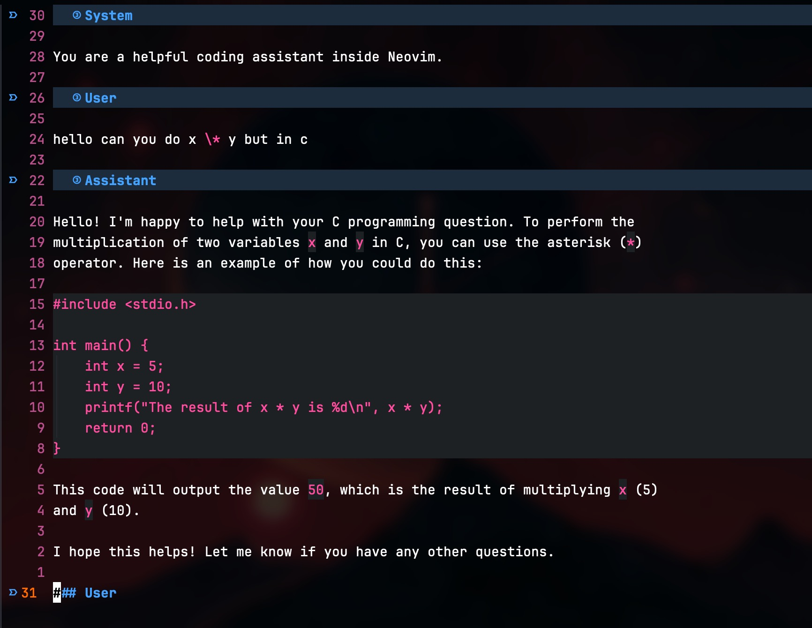

# ollamarun.nvim

**Chat with local LLMs (like DeepSeek Coder) directly inside Neovim** using an
interactive markdown buffer and the [Ollama](https://ollama.com) CLI.

The chat lives inside a Markdown file, so code snippets and text formatting work
naturally with tools like **marksman** or **markdown-preview**.

Perfect for in-editor AI coding assistance, quick explanations, or note-taking
with models like `deepseek-coder-v2`, `llama3`, `codellama`, etc.

---

## Features

- Interactive chat with Ollama in a Markdown buffer
- Auto-inserts `### User` / `### Assistant` blocks for clarity
- Live streaming responses, updated inline
- Cleans up ANSI escape sequences from output
- Minimal, no external dependencies

---

## Installation

### With `lazy.nvim`

```lua
{
  "Dheeraj-Murthy/ollamarun.nvim",
  config = function()
    require("ollamarun").setup({
      model = "deepseek-coder-v2", -- optional, defaults to this
    })
  end
}
```

### With `packer.nvim`

```lua
use {
  "Dheeraj-Murthy/ollamarun.nvim",
  config = function()
    require("ollamarun").setup()
  end
}
```

---

## Usage

1. Run `:OllamarunChat` to open or jump to the chat buffer (`OllamaChat.md`).
2. Type your message under the `### User` block.
3. Press `<Enter>` in normal mode to send it.
4. The model’s response will stream back under a new `### Assistant` block.

---

## Requirements

- [Ollama](https://ollama.com) installed (`ollama run ...` must work in your
  terminal)
- An Ollama-compatible model (e.g. `deepseek-coder-v2`, `codellama`, `llama3`)

Example to get started:

```bash
ollama run deepseek-coder-v2
```

---

## Preview



▶️ Demo video: [media/demo-fast.mp4](media/demo-fast.mp4)

---

## Roadmap

- [ ] Session history / persistence
- [ ] Model switching from inside Neovim
- [ ] Telescope integration to browse past sessions
- [ ] Richer Markdown formatting for roles

---

## Author

**M. S. Dheeraj Murthy**  
[GitHub](https://github.com/Dheeraj-Murthy) ·
[LinkedIn](https://www.linkedin.com/in/dheeraj-murthy-m-s-6b7784290)

---

## Contributing

Contributions are welcome — issues, PRs, and ideas!  
If you build something cool on top (prompt templates, chaining commands,
Telescope pickers, etc.), feel free to share it.
